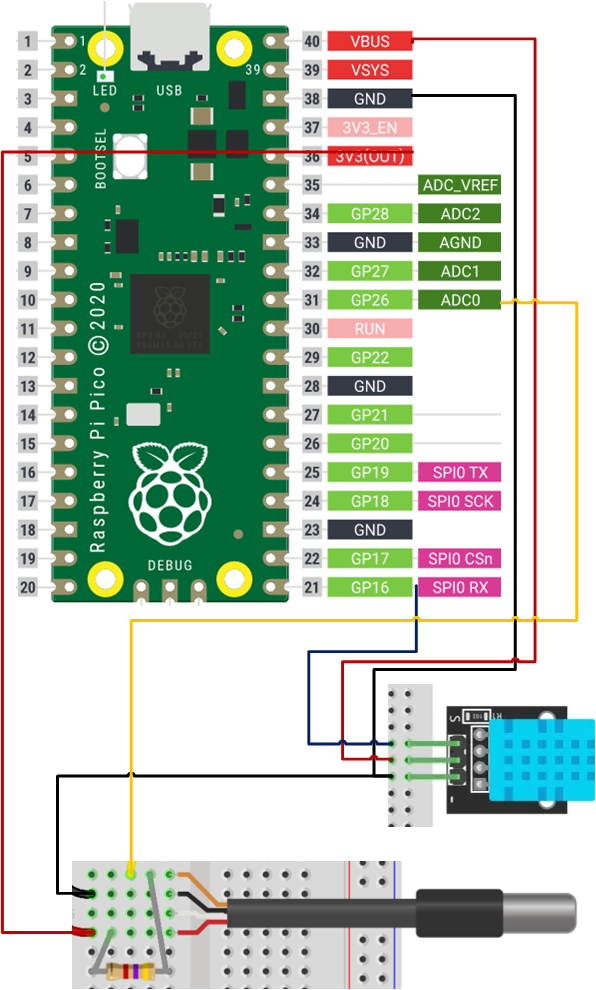

# 2023_pi_pico_ths

## 11th July 2023 ##

With my new Air Conditioner arriving Thursday (hopefully) I'd like a way to check how effective it is.

I made a temperature logger before using an ESP32 - but I'm hoping this will only be temporary, so I'm going to sacrifice a Pi Pico W for now.

I'm using that because I want to try and log to a cloud service - and my first attempt with be AdaFruit IO - and they support pi pico w in their examples.

Before I connect up the pico W, I'm going to just connect some sensors I have in my parts box to a pico (non-W)

KY-015 TEMPERATURE AND HUMIDITY SENSOR MODULE

Based on DHT11

Also using a DS18B20-compatible 1-wire sensor

After some issue with the connections causing the one-wire scan to crash the bus, I got some plausible readings.

Soldered up some pin headers onto the W and a bit of perf board, but it's slightly too small - and now I'm out of headers, so parking the wiring until amazon can get me some more.

I also did an experiment putting `wippersnapper` image onto the pi pico W, and once I had completed my secrets.json, it connected to my adafruit.io account as a device.

https://io.adafruit.com/DrMikeG/devices/rpi-pico-w2367206

It's not exactly clear how I configure this - there is a macro which allows me to add a DS18B20 on a specific pin.

I don't see an component for DHT11.

It basically looks a real pain to do stuff of the beaten path here.

It's going to be significantly cheaper (time vs cost) to buy a £4 i2c temp sensor board that works out the box...

That way I can get back to learning PIO, and my 3d scanner...